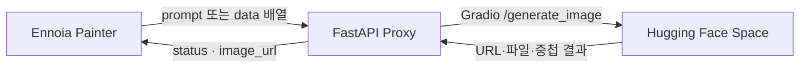

# HF ProxyAPI

Ennoia가 직접 만들 수 없었던 Hugging Face Gradio 요청을 대신 처리하고, 생성 결과를 이미지 URL로 돌려주는 FastAPI 어댑터다.

이 서버는 [Paws on Keyboard](https://github.com/kanghyunsoon/Paws-on-Keyboard)의 Painter 에이전트와 Hugging Face Space 사이에 둔 별도 배포 단위다.

## 만든 이유

Ennoia 에이전트는 이미지 프롬프트를 만들 수 있었지만, 다음 처리를 코드로 구현할 수 없었다.

- Gradio `/generate_image`가 요구하는 6개 인자를 순서대로 구성
- 응답이 URL인지 로컬 파일인지 판별
- 배열이나 중첩 객체 안에서 이미지 값 탐색
- 로컬 결과 파일을 브라우저가 읽을 수 있는 URL로 변환

이 변환을 프롬프트에 계속 포함하지 않고 HTTP 서버 경계로 분리했다.



## 담당한 문제와 해결

### 1. Ennoia 요청과 Gradio 입력이 달랐다

단순한 객체와 Gradio 형태의 `data` 배열을 모두 받도록 Pydantic 모델에서 정규화했다.

```json
{
  "prompt": "a dog picture diary in crayon style",
  "seed": 1234
}
```

```json
{
  "data": [
    "a dog picture diary in crayon style",
    768,
    1024,
    8,
    1234,
    false
  ]
}
```

두 요청은 내부에서 `prompt`, `width`, `height`, `guidance_scale`, `seed`, `randomize_seed` 여섯 값으로 맞춰진다.

### 2. Gradio 결과 형태가 고정되지 않았다

`find_image_value`가 `str`, `dict`, `list`, `tuple`을 재귀 탐색한다. 객체에서는 `url`, `path`, `name`, `file`, `image` 키를 먼저 확인한다.

결과가 외부 URL이면 그대로 반환하고, 로컬 파일이면 UUID 파일명으로 `outputs`에 복사해 정적 URL로 제공한다.

### 3. 에이전트가 사용할 응답을 분리했다

Ennoia는 응답에서 `image_url`만 사용한다.

```json
{
  "status": "success",
  "image_url": "https://proxy.example.com/outputs/uuid.png"
}
```

프록시는 원본 Gradio 결과도 `raw_result`에 남겨 연결 오류를 확인할 수 있게 했다.

## 구현 수치

| 항목 | 현재 구현 |
| --- | ---: |
| Python 코드 | 105줄 |
| HTTP 엔드포인트 | 2개 |
| 지원 요청 형태 | 2개 |
| 탐색하는 객체 키 | 5개 |
| 필수 응답 값 | `image_url` 1개 |

## 코드 시작점

- 요청 정규화: `ImageRequest.normalize_gradio_data`
- 결과 탐색: `find_image_value`
- 로컬 파일 공개: `to_public_image_url`
- Hugging Face 호출: `generate`

## 현재 한계

- Hugging Face Space의 함수명과 인자 순서가 바뀌면 프록시도 수정해야 한다.
- 생성 파일 만료와 저장 공간 정리 작업은 구현하지 않았다.
- 재시도, 요청 제한, 작업 큐는 없다.
- 자동화 테스트와 응답 시간 측정 기록은 없다.
- 현재 코드는 공개 Space 호출을 기준으로 확인했다.
